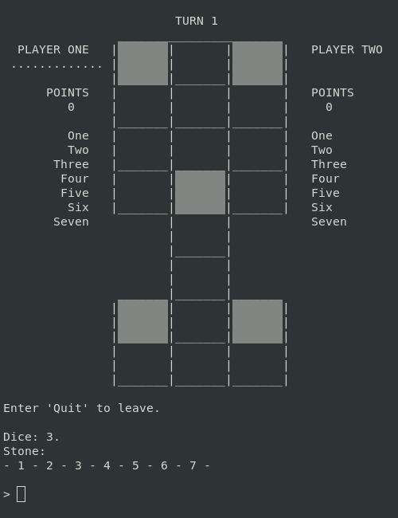

# Twenty Squares

*Twenty Squares* is a CLI video game, that is to say that it runs in a 
computer's terminal. Besides this very repo, it can also be found as a 
mini-game in 
[Treasure Venture](https://github.com/LycorisDev/c_game_treasure-venture).  

---

It's based upon the oldest game known to mankind: a five millennia old 
mesopotamian board game, known today as the "royal game of Ur" or the "game of 
twenty squares". The purpose of this project is to provide a classic version of 
the game, as well as a new take on it, which exploits possibilities offered by 
a computer.  

The game has four modes:
1. Classic Infinite.
2. Classic Dispatch.
3. Deadly Sins Infinite.
4. Deadly Sins Dispatch.

Classic Infinite is the mode which reproduces an existing ruleset. There are 
different ones out there, and I've picked Finkel. This is the most popular 
ruleset, and for good reason: it's probably the most accurate. To me, this is 
actually it, but... What do I know? Again, I'm not an immortal, trust 😉  

On these notes, I reserve special thanks to Irving Finkel of the British Museum 
and Tom Scott, who was his guest in the Museum's 
[introductory video on the royal game of Ur](https://www.youtube.com/watch?v=WZskjLq040I). 
Let's make this game known worldwide!  

