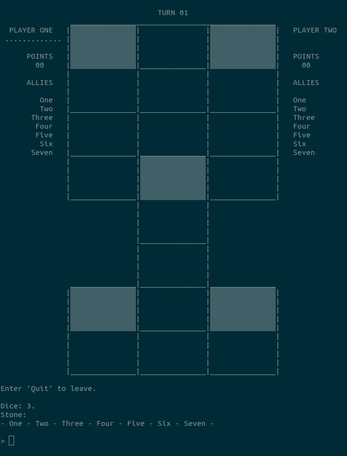

# Twenty Squares

*Twenty Squares* is a CLI video game, that is to say that it runs in a computer's terminal. It's also cross-platform, so it can be run on Windows 64-bit and 32-bit, as well as on Unix-based systems like MacOS and Linux. As for the API used to develop it, it's the C programming language.  

It can be found as a mini-game in [Treasure Venture](https://github.com/LycorisDev/c_game_treasure-venture).  

---

It's based upon the oldest game known to mankind: a five millennia old mesopotamian board game, known today as the Game of Twenty Squares or the Royal Game of Ur. Its purpose is to provide a "classic" version of the game, as well as a new take on it, that exploits possibilities brought by a computer.  

The game has four levels:
1. Classic Infinite.
2. Classic Dispatch.
3. Deadly Sins Infinite.
4. Deadly Sins Dispatch.

On these notes, I reserve special thanks to Irving Finkel of the British Museum and Tom Scott, who was his guest in the Museum's [introductory video on the Royal Game of Ur](https://www.youtube.com/watch?v=WZskjLq040I). This video is how I came to learn of the game, and I've used the simple rules described in it to make the first level.  

